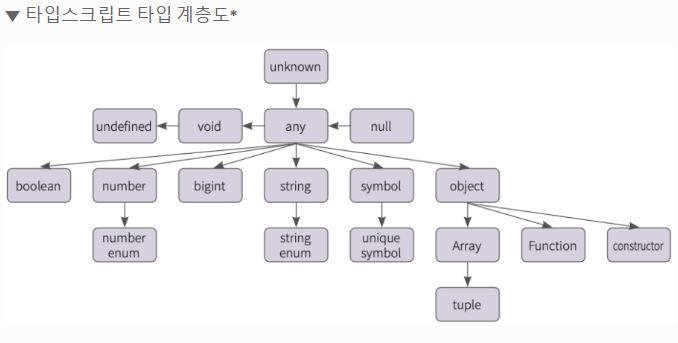

# 타입스크립트 변수

## 타입 명시하기

> "strictNullChecks": true 설정에 의해 반드시 해당 타입의 값 대입해야 한다.

- 선업 방법
  - `const`
  - `let`
  - `var`
- 선언 형식
  - 변수명: 타입 = 값

### 타입 종류

- `null`: 의도적으로 값이 없음
- `undefined`: 값이 할당되지 않음
- `number`: 숫자(~2^52)
  - 정수(10진수, 16진수, 8진수)
  - 부동 소수점
- `string`: 문자
- `boolean` : 논리 값
  - true
  - false
- `bigint`: number 이상의 값
  - 숫자 뒤에 n을 붙여서 표현 _ex. 123n_
  - es2020부터 지원
- `symbol`: 모든 값에 대해 유일한 독특한 값
- `literal`: 변수의 값이 지정한 것 중에 하나만 사용

## 합집합(Union)

> 변수의 값이 지정한 여러개의 타입 중 한개의 타입을 지정할 수 있다.

### 사용방법

```ts
// |를 이용한다.
let union: string | number | ...;
```

## 교집합(Intetsection)

> A이면서 B인 타입을 정의한다.

지양하는 것이 좋다.

### 사용방법

```ts
// &를 이용한다.
type 타입명A {
  ...
}

type 타입명B {
  ...
}

type 타입명C = 타입명A & 타입명B;
```

## 타입 별칭(Alias)

> 자주 사용하는 유니온 타입을 별칭으로 지정해서 재사용

### 사용방법

```ts
type 지정할_타입명 = string | number | ...;
```

> 타입 계층도
> 
